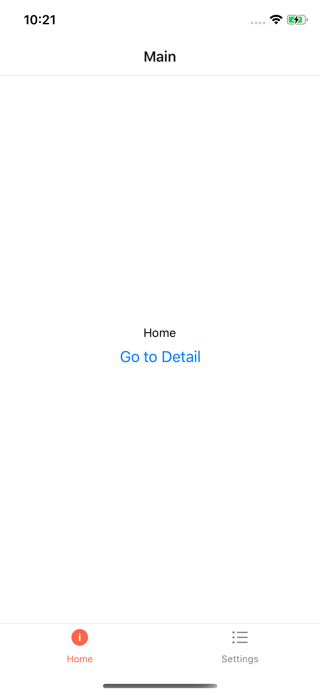
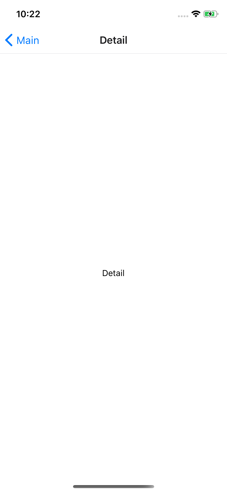
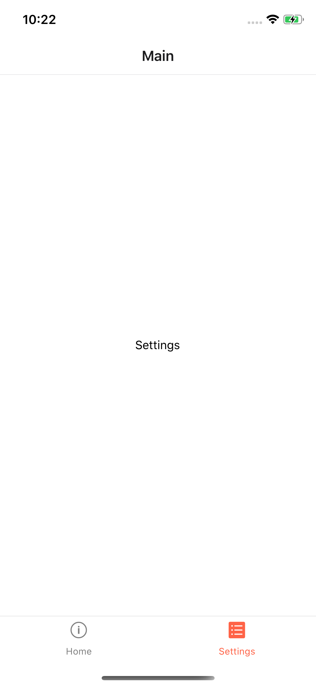

## 개요

하단 탭 네비게이션이 있고, 첫 화면의 버튼을 클릭하면 상세 페이지로 탐색되는 화면을 구성합니다.
상세 페이지로 이동될 때, 하단 탭 네비게이션을 출력하고 싶지 않습니다.

위와 같은 탐색을 구현하기 위해 간략하게 코드를 작성했습니다.

### 프로젝트 준비

```shell
$ expo init react-native-expo-navigation
```

> 저는 보통 빈 타입스크립트 프로젝트 템플릿을 사용합니다.

선택사항

버젼제어로 git 을 사용합니다.

```shell

$ cd react-native-expo-navigation   # 프로젝트 디렉터리로 이동
$ git init                          # git 로컬 저장소 초기화
$ git remote add origin {저장소 URI} # git 원격 저장소 정보 추가
$ git add --all                     # 추가된 파일 스테이징
$ git commit -m "엑스포 스케폴딩"     # 커밋 작성
$ git push -u origin master         # 원격 저장소에 커밋 전송
```

개발 브랜치 `dev`를 작성합니다.

```shell
$ git checkout -b dev               # dev 브랜치를 작상하고 현재 브랜치 변경
```

## 필요 패키지 설치

이 문서에서는 [React Navigation](https://reactnavigation.org/) 을 사용합니다.

[React Navigation Getting started 페이지](https://reactnavigation.org/docs/en/getting-started.html)에 자세한 정보가 있습니다.

### react-navigation/native 설치

[@react-navigation/native](https://www.npmjs.com/package/@react-navigation/native) 패키지를 추가합니다.

```shell
$ npm install --save @react-navigation/native
```

또는

```shell
$ yarn add @react-navigation/native
```

의존 패키지를 설치합니다.

```shell
$ expo install react-native-gesture-handler react-native-reanimated react-native-screens react-native-safe-area-context @react-native-community/masked-view
```

스택 네이게이터와 하단 탭 네비게이터를 작성할 예정이므로 아래 패키지를 추가합니다.

```shell
$ npm install --save @react-navigation/stack @react-navigation/bottom-tabs
```

또는

```shell
$ yarn add @react-navigation/stack @react-navigation/bottom-tabs
```

## 코드 작성 준비

린트와 포맷터를 설정합니다.

저는 프로젝트를 만들면 린트를 설정하고, 프리티어로 코트 포맷터를 설정한 후 진행합니다.

### 패키지 추가

```shell
$ npm install --save-dev eslint prettier eslint-plugin-react eslint-plugin-import eslint-plugin-jsx-a11y @typescript-eslint/eslint-plugin eslint-config-airbnb-typescript eslint-config-prettier eslint-plugin-prettier @react-native-community/eslint-config @react-native-community/eslint-plugin eslint-plugin-react-hooks
```

```shell
$ yarn add eslint prettier eslint-plugin-react eslint-plugin-import eslint-plugin-jsx-a11y @typescript-eslint/eslint-plugin eslint-config-airbnb-typescript eslint-config-prettier eslint-plugin-prettier @react-native-community/eslint-config @react-native-community/eslint-plugin eslint-plugin-react-hooks --dev
```

### 린트 구성 파일 추가

프로젝트 디렉터리에 `.eslintrc` 파일을 추가하고, 아래 코드를 작성합니다.

```json
{
    "root": true,

    "parser": "@typescript-eslint/parser",
    "plugins": ["@typescript-eslint", "react-hooks"],
    "extends": ["@react-native-community", "prettier", "prettier/@typescript-eslint", "prettier/react"],
    "rules": {
        "@typescript-eslint/no-use-before-define": "off",
        "import/prefer-default-export": "off",
        "react/prop-types": "off",
        "react-hooks/rules-of-hooks": "error",
        "react-hooks/exhaustive-deps": "warn"
    }
}
```

### 프리티어 구성 파일 추가

프로젝트 디렉터리에 `.prettierrc` 파일을 추가하고, 아래 코드를 작성합니다.

```json
{
    "singleQuote": true,
    "trailingComma": "all",
    "tabWidth": 4,
    "semi": true,
    "printWidth": 80
}
```

### npm 스크립트 추가

프로젝트 디렉터리의 package.json 파일을 열고, 아래 스크립트를 추가합니다.

```json
"srcipts": {
    "lint": "tsc --noEmit && eslint --ext .ts,.tsx ./",
    "prettier": "npx prettier --write **/*.{ts,tsx,json} && npx prettier --write *.{ts,tsx,json}"
}
```

### 린트 실행

아래 명령으로 린트를 실행합니다.

```shell
$ npm run lint
```

또는

```shell
$ yarn lint
```

### 코드 포맷팅 실행

아래 명령으로 코드 포맷팅을 실행합니다.

```shell
$ npm run prettier
```

또는

```shell
$ yarn prettier
```

> Visual Studio Code 와 같이 코드 편집기가 포맷팅을 지원하고, prettier 확장을 설치할 수 있으면 보통 파일을 저장할 때, 포맷팅을 하도록 구성할 수 있습니다.

## 네비게이션

### 네비게이션 컨테이너

`navigations` 디렉터리를 만들고 `Navigation.tsx` 파일을 추가합니다.

```typescript
import React from 'react';
import { NavigationContainer } from '@react-navigation/native';

export const Navigation: React.FC = ({ children }) => {
    return <NavigationContainer>{children}</NavigationContainer>;
};
```

### 스택 네비게이션

`navigations` 디렉터리에 `Stack.ts` 파일을 추갛합니다.

```typescript
import { createStackNavigator } from '@react-navigation/stack';

export const Stack = createStackNavigator();
```

### 하단 탭 네비게이션

`navigations` 디렉터리에 `BottomTab.ts` 파일을 추갛합니다.

```typescript
import { createBottomTabNavigator } from '@react-navigation/bottom-tabs';

export const BottomTab = createBottomTabNavigator();
```

## 뷰 컴포넌트

실행해서 확인하기 위해 세개의 컴포넌트를 작성합니다.

세 페이지는 거의 동일하게 출력되며, 중앙에 뷰 컴포넌트의 이름을 추가해서 페이지 이동을 확인합니다.

`views` 디렉터리를 만들고, 각 화면의 디렉터리를 만들어 컴포넌트 파일을 작성합니다.

### 홈

응용 프로그램이 실행되면 처음에 보여질 화면입니다.

`views/home/Home.tsx` 파일

```typescript
import React from 'react';
import { View, Text, StyleSheet, Button } from 'react-native';

export const Home = ({ navigation }) => {
    return (
        <View style={styles.container}>
            <Text>Home</Text>
            <Button title="Go to Detail" onPress={() => navigation.navigate('Detail', { name: 'Hello' })} />
        </View>
    );
};

const styles = StyleSheet.create({
    container: {
        flex: 1,
        backgroundColor: '#fff',
        alignItems: 'center',
        justifyContent: 'center',
    },
});
```

`views/home/index.ts` 파일

```typescript
export { Home } from './Home';
```

### 상세

홈 화면에서 스택 네비게이션으로 이동되는 화면입니다.

`views/detail/Detail.tsx` 파일

```typescript
import React from 'react';
import { View, Text, StyleSheet } from 'react-native';

export const Detail = () => {
    return (
        <View style={styles.container}>
            <Text>Detail</Text>
        </View>
    );
};

const styles = StyleSheet.create({
    container: {
        flex: 1,
        backgroundColor: '#fff',
        alignItems: 'center',
        justifyContent: 'center',
    },
});
```

`views/detail/index.ts` 파일

```typescript
export { Detail } from './Detail';
```

### 설정

하단 탭 네비게이션으로 이동되는 화면입니다.

`views/settings/settings.tsx` 파일

```typescript
import React from 'react';
import { View, Text, StyleSheet } from 'react-native';

export const Settings = () => {
    return (
        <View style={styles.container}>
            <Text>Settings</Text>
        </View>
    );
};

const styles = StyleSheet.create({
    container: {
        flex: 1,
        backgroundColor: '#fff',
        alignItems: 'center',
        justifyContent: 'center',
    },
});
```

`views/settings/index.ts` 파일

```typescript
export { Settings } from './Settings';
```

## 컴포넌트와 네비게이션 구성

각 네비게이션과 뷰 컴포넌트를 조합합니다.

홈 컴포넌트에서 상세 컴포넌트로 이동될 때, 하단 탭을 보여주지 안게 하기 위해, 스택 네비게이션 내부에 탭 네비게이션을 배치합니다.

### 하단 탭 네비게이션 구성

`views/mainBottomTab/MainBottomTab.tsx` 파일

> 아이콘의 사용과 색상은 [React Navigation: Tab navigation 페이지](https://reactnavigation.org/docs/en/tab-based-navigation.html)를 참조했습니다.

```typescript
import React from 'react';
import { Ionicons } from '@expo/vector-icons';
import { BottomTab } from '../../navigations';
import { Home } from '../Home';
import { Settings } from '../Settings';

export const MainBottomTab = () => {
    return (
        <BottomTab.Navigator
            screenOptions={({ route }) => ({
                tabBarIcon: ({ focused, color, size }) => {
                    let iconName;

                    if (route.name === 'Home') {
                        iconName = focused ? 'ios-information-circle' : 'ios-information-circle-outline';
                    } else if (route.name === 'Settings') {
                        iconName = focused ? 'ios-list-box' : 'ios-list';
                    }

                    // You can return any component that you like here!
                    return <Ionicons name={iconName} size={size} color={color} />;
                },
            })}
            tabBarOptions={{
                activeTintColor: 'tomato',
                inactiveTintColor: 'gray',
            }}
        >
            <BottomTab.Screen name="Home" component={Home} />
            <BottomTab.Screen name="Settings" component={Settings} />
        </BottomTab.Navigator>
    );
};
```

`views/mainBottomTab/index.ts` 파일

```typescript
export { MainBottomTab } from './MainBottomTab';
```

### 메인 네비게이션 구성

`views/mainNavigation/MainNavigation.tsx` 파일

```typescript
import React from 'react';
import { Stack } from '../../navigations';
import { MainBottomTab } from '../mainBottomTab';
import { Detail } from '../detail';

export const MainNavigator = () => {
    return (
        <Stack.Navigator>
            <Stack.Screen name="Main" component={MainBottomTab} />
            <Stack.Screen name="Details" component={Detail} />
        </Stack.Navigator>
    );
};
```

`views/mainNavigation/index.ts` 파일

```typescript
export { MainNavigator } from './MainNavigator';
```

### App.tsx 파일 변경

`App.tsx` 파일을 변경합니다.

```typescript
import React from 'react';
import { Navigation } from './navigations';
import { MainNavigator } from './views/mainNavigator';

export default function App() {
    return (
        <Navigation>
            <MainNavigator />
        </Navigation>
    );
}
```

## 실행

```shell
$ npm run start
```

```shell
$ yarn start
```

가상장치를 연결해보면 아래와 같이 동작합니다.







## 마치며

이전에는 뭔가 굉장히 복잡하게 정적 메서드를 사용하는 복잡한 코드였던 것 같은데, 생각보다 매우 편리하게 변한것 같아요.

전체 코드는 [GitHub](https://github.com/bbonkr/react-native-expo-navigation) 에서 확인하실 수 있어요.

[엑스포 페이지](https://expo.io/@bbonkr/react-native-expo-navigation)에서 또는 아래 QR 코드로 모바일 장치에 expo를 설치하고 실행해보실 수 있어요.


