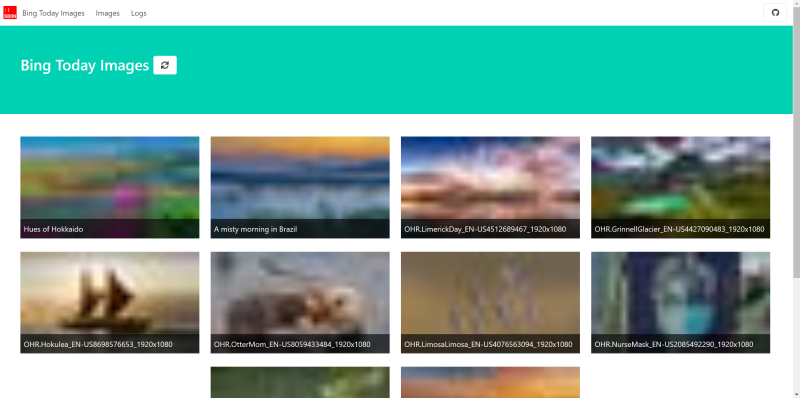
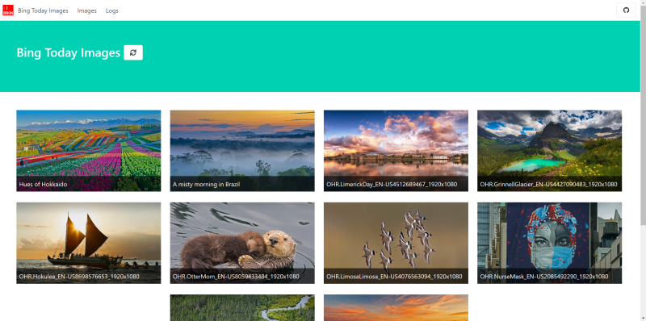
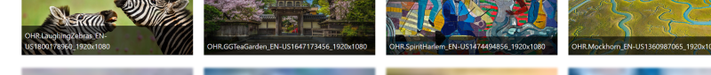

[bing.com](https://bing.com) 은 마이크로소프트에서 서비스하는 검색서비스입니다. 

이 사이트는 매우 아름다운 배경 이미지를 제공합니다.

여기서 제공되는 배경 이미지를 데스크톱 배경으로 사용하고 싶어서 어떻게 얻을 수 있나 찾아보니 이미지 정보를 제공하는 API 가 있습니다.

API 를 사용해서 특정시간에 새로운 이미지가 있으면 이미지 파일을 수집하고, 수집된 파일을 배경화면으로 사용하고자 합니다.

저는 작은 서버를 실행하고 있는데, 이 서버에 도커 컨테이너로 실행해서 파일을 수집하고 있습니다.

파일이 저장되는 위치를 [원드라이브 <small>OneDrive</small>](https://www.microsoft.com/ko-kr/microsoft-365/onedrive/online-cloud-storage)와 동기화되는 위치를 지정해서 새로운 이미지 파일이 수집되면 여러 장치에서 추가된 이미지를 활용할 수 있습니다.

코드는 [GitHub: bbonkr/bing-wallpaper](https://github.com/bbonkr/bing-wallpaper) 에서 확인하실 수 있습니다.


## 📢 API

### Overview

`https://www.bing.com/HPImageArchive.aspx` 주소로 `GET` 요청하면 이미지 정보를 `JSON` 또는 `XML` 형식으로 응답합니다.

`https://www.bing.com/HPImageArchive.aspx?format=js&idx=1&n=10&mkt=en-US` 로 요청하면 아래와 같은 JSON 데이터를 얻을 수 있습니다.

```json
{
    "images": [
        {
            "startdate": "20210514",
            "fullstartdate": "202105140700",
            "enddate": "20210515",
            "url": "/th?id=OHR.AltaFloresta_EN-US4736416258_1920x1080.jpg&rf=LaDigue_1920x1080.jpg&pid=hp",
            "urlbase": "/th?id=OHR.AltaFloresta_EN-US4736416258",
            "copyright": "Amazon rainforest with morning fog near Alta Floresta, Mato Grosso, Brazil (© Pulsar Imagens/Alamy)",
            "copyrightlink": "https://www.bing.com/search?q=amazon+rainforest&form=hpcapt&filters=HpDate%3a%2220210514_0700%22",
            "title": "A misty morning in Brazil",
            "quiz": "/search?q=Bing+homepage+quiz&filters=WQOskey:%22HPQuiz_20210514_AltaFloresta%22&FORM=HPQUIZ",
            "wp": true,
            "hsh": "69ac50eb336f9af0ab3b2f6af61ac32c",
            "drk": 1,
            "top": 1,
            "bot": 1,
            "hs": []
        },
        // 생략
    ],
    "tooltips": {
        "loading": "Loading...",
        "previous": "Previous image",
        "next": "Next image",
        "walle": "This image is not available to download as wallpaper.",
        "walls": "Download this image. Use of this image is restricted to wallpaper only."
    }
}
```


### Model

응답 모델

```typescript
interface ResponseModel {
    images: ImageModel[];
    tooltips: TooltipModel;
}
```

이미지 정보 모델

```typescript
interface ImageModel {
    startdate: string;
    fullstartdate: string;
    enddate: string;
    url: string;
    urlbase: string;
    copyright: string;
    copyrightlink: string;
    title: string;
    quiz: string;
    wp: boolean;
    hsh: string;
    drk: number;
    top: number;
    bot: number;
    hs: any[];
}
```

툴팁 정보 모델

```typescript
interface TooltipModel {
    loading: string;
    previous: string;
    next: string;
    walle: string;
    walls: string;
}
```


## 🌈 Application

Bing Today Images Collector 응용프로그램은 .NET 5 기반의 백엔드와 React 기반의 프론트엔드로 구성되어 있습니다.

백엔드는 프론트엔드에서 사용할 데이터를 제공하는 API 와 지정된 일정에 이미지를 수집하는 작업으로 구성됩니다. 

프론트엔드는 ASP.NET Core 에서 브라우저 라우트를 사용하고, [Bulma](https://bulma.io) 디자인을 기반으로 작성했습니다.


### Backend

.NET 5 의 `webapi` 템플릿으로 프로젝트를 작성했고, ORM 은 Entity Framework Core 를 사용합니다.

DBMS 는 Microsoft SQL Server 를 사용합니다.

 

### Frontend

Typescript로 React 를 기반으로 작성하고, [webpack](https://webpack.js.org/)으로 번들링해서 wwwroot/js 디렉터리에 파일을 작성합니다.

레이아웃 등의 디자인 요소는 능력이 부족하므로, 잘 다듬어진 CSS 프레임워크 중 [bulma](https://bulma.io/) 를 사용합니다. 


### Scheduled Job

백엔드에서 일정에 따른 작업실행을 위해 [NuGet: CronScheduler.AspNetCore](https://www.nuget.org/packages/CronScheduler.AspNetCore/) 패키지를 사용합니다.

CronScheduler.AspNetCore 패키지는 [크론 <small>Cron</small>](https://www.google.com/url?sa=t&rct=j&q=&esrc=s&source=web&cd=&cad=rja&uact=8&ved=2ahUKEwjj-uDeqc3wAhVCa94KHYBGAvAQFjAAegQIAxAD&url=https%3A%2F%2Fko.wikipedia.org%2Fwiki%2FCron&usg=AOvVaw2oL-AjqKZHRXRGTCk6lfH-) 에서 사용하는 일정 정의 형식으로 작업 일정을 정의할 수 있습니다.

```plaintext
                                       Allowed values    Allowed special characters   Comment

┌───────────── second (optional)       0-59              * , - /
│ ┌───────────── minute                0-59              * , - /
│ │ ┌───────────── hour                0-23              * , - /
│ │ │ ┌───────────── day of month      1-31              * , - / L W ?
│ │ │ │ ┌───────────── month           1-12 or JAN-DEC   * , - /
│ │ │ │ │ ┌───────────── day of week   0-6  or SUN-SAT   * , - / # L ? Both 0 and 7 means SUN
│ │ │ │ │ │
* * * * * *
```

지정된 일정에 Bing Today Image API 를 요청해서 수집되지 않은 이미지 파일을 지정된 디렉터리에 파일로 저장합니다.


### Generate Thumbnail

.NET Standard 에는 System.Drawing 네임스페이스에 이미지를 다루는 클래스들이 구현되어 있습니다.

[Nuget: System.Drawing.Common](https://www.nuget.org/packages/System.Drawing.Common/) 패키지로 제공됩니다.

그런데, [GDI+ API](https://docs.microsoft.com/ko-kr/windows/win32/gdiplus/-gdiplus-gdi-start)를 사용합니다. Windows 기반에서만 사용할 수 있습니다.

작성중인 응용프로그램은 Docker 이미지 기반으로 게시할 예정입니다. 

Linux 에서도 사용이 가능해야 합니다. 

`system.drawing.common linux` 키워드로 검색하면, 여러가지 해결 방법을 찾을 수 있습니다.

그 중 매우 사용이 간편하고, 크래스플랫폼인 [Magick.NET-Q16-AnyCPU 패키지](https://www.nuget.org/packages/Magick.NET-Q16-AnyCPU/)를 사용했습니다.

아래와 같이 파일 경로를 입력해서 초기화하고, 작성된 인스턴스를 사용해서 크기를 변경한 후 변경사항을 입력된 경로에 파일로 작성할 수 있습니다.

```csharp
using (var image = new MagickImage(imageFilePath))
{
    image.Thumbnail(30, 0);

    image.Write(thumbnailFilePath);
}
```


### Intersection Observer

이미지를 많이 출력해야 하므로, `img` 요소를 [Intersection Observer API](https://developer.mozilla.org/ko/docs/Web/API/Intersection_Observer_API) 를 사용해서 Viewport 의 내부의 변화를 비동기로 추적합니다.

지정된 `img` 요소에 썸네일 이미지를 블러 효과를 추가해서 출력하고, `img` 요소가 30% 이상 Viewport 에 표현될 때, 실제 이미지를 요청해서 출력하는 방식으로 컴포넌트 동작을 개선했습니다.





페이지 아래쪽을 천천히 스크롤하면 아래와 같이 화면에 블러효과가 추가된 썸네일 이미지가 출력됩니다. 

스크롤을 더 내려 30% 이상이 출력될 때, 실제 이미지를 요청합니다.




## 📦 Container

아직 CI/CD 를 구성하지 못했지만, Dockerfile 로 도커 이미지를 빌드할 수 있습니다.

`docker-compose.webapp.yml` 파일을 참조해서 docker-compose.yml 파일을 작성해서 사용하면 편리합니다.

볼륨 <small>volumes</small>  `/app/images` 에 마운트되는 위치를 지정해서 컨테이너 실행 유무에 관계없이 파일을 유지할 수 있습니다.

아래 명령으로 docker-compose 로 이미지를 빌드하고, 컨테이너는 실행합니다.

```bash
$ docker-compose up -d --build
```


## ✍️ Review

Windows Service 로 작성했다가, PC가 켜져있지 않을 때도 파일을 수집하기 위해 linux Daemon 으로 변경했습니다.

그런데, 수집된 파일을 확인하려면 PC 를 켜서 디렉터리를 확인해야 했습니다. 

불편해서 언제 어디서나 이미지 파일을 확인하려고 프론트엔드를 추가했습니다.

생각했던 기능이 대부분 구현되어 이 프로젝트를 종료합니다.


프로젝트 기간: [2019-10](https://github.com/bbonkr/bing-wallpaper/commit/d3acf1db75be3ed90f8d2f143334844485a317e9) ~ 2021-05 <small>(커밋 작성 시각 기준)</small>


## 🚀 References

*   [.NET](https://dotnet.microsoft.com/)
*   [Entity Framework Core](https://docs.microsoft.com/ko-kr/ef/core/)
*   [React](https://ko.reactjs.org/)
*   [TypeScript](https://www.typescriptlang.org/)
*   [docker](https://www.docker.com/)
*   [Docker Compose](https://docs.docker.com/compose/)
*   [CronScheduler.AspNetCore](https://github.com/kdcllc/CronScheduler.AspNetCore)
*   [Intersection Observer API](https://developer.mozilla.org/ko/docs/Web/API/Intersection_Observer_API)
*   [dlemstra/Magick.NET](https://github.com/dlemstra/Magick.NET)

