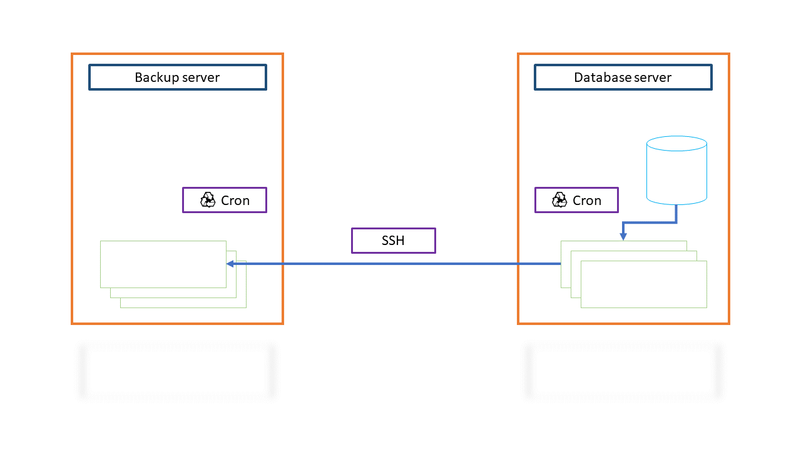

## 개요

외부에서 접근가능한 응용프로그램 데이터베이스 서버에 작성된 데이터 백업 파일을 외부에서 접근이 불가능한 파일 백업 서버로 수집해서 보관하기 위한 구성입니다.




## 데이터베이스 서버

### 데이터베이스 백업

MariaDB 가 Docker 컨테이너로 실행되고 있습니다.

Cron 일정 작업으로 일일 백업을 진행합니다.

```bash
$ docker exec --user root mariadb /bin/bash -c "mysqldump -u <db-user> -p'<db-password>' <database-name>
```

* `db-user`: 데이터베이스 사용자 이름입니다.
* `db-password`: 데이터베이스 사용자의 비밀번호입니다.
* `database-name`: 덤프할 데이터베이스 이름입니다.

### 작업

아래와 같이 스크립트를 만들어 백업 파일의 이름을 백업 일자를 포함하게 구성합니다.

backup.sh 파일의 내용입니다.

```bash
#!/bin/bash
PATH=/usr/local/sbin:/usr/local/bin:/usr/sbin:/usr/bin:/sbin:/bin

# decide where database backup file
WORK_DIR=<decide-where-database-backup-file>
DATABASE_NAME=<database-name>
DATABASE_USERNAME=<database-user-name>
DATABASE_PASSWORD=<database-user-password>
TODAY=`date +%Y%m%d`

# backup file name prefix
BACKUP_FILE=db.$TODAY

# backup file extension
SQL=.sql
# archive file extension
GZ=.tar.gz
echo Run at $TODAY

# make backup file
echo $WORK_DIR
cd $WORK_DIR

echo wordpress database backup to $BACKUP_FILE$SQL
docker exec --user root mariadb /bin/bash -c "mysqldump -u $DATABASE_USERNAME -p'$DATABASE_PASSWORD' $DATABASE_NAME" > $BACKUP_FILE$SQL

# archive
echo Archiving ...
tar -cvzf $BACKUP_FILE$GZ $BACKUP_FILE$SQL

# remove sql
echo Clearing ...
rm $BACKUP_FILE$SQL

# Remove older than 5 days. (5 days * 24hr)
find . -maxdepth 1 -name "db.*.tar.gz" -type f -mtime +5 -exec rm {} \;

echo Done.
```

* `decide-where-database-backup-file`: 데이터베이스 백업 파일을 보관할 디렉터리를 지정합니다.
* `database-name`: 백업 대상 데이터베이스 이름을 지정합니다.  
* `database-user-name`: 데이터베이스 사용자 이름을 지정합니다.
* `database-user-password`: 데이터베이스 사용자 비밀번호를 지정합니다.

### Cron

크론 작업을 등록합니다.

```bash
$ crontab -e
```

편집기가 열리면 아래와 같이 데이터베이스 백업 스크립트를 실행할 일정과 함께 백업 스크립트 실행 명령을 작성합니다.

> 매일 03:00 마다 backup.sh 스크립트를 실행하고, 스크립트 실행 중 출력되는 내용을 path-to-backup-result-file 에 작성합니다.

```
0 3 * * * <path-to-backup.sh-file> >> <path-to-backup.log-file>
```

* `path-to-backup.sh-file`: backup.sh 파일의 전체 경로를 지정합니다.
* `path-to-backup-result-file`: backup.log 파일의 전제 경로를 지정합니다.

스크립트 실행중 출력되는 내용을 무시하려면 아래와 같이 작성합니다.

```
0 3 * * * <path-to-backup.sh-file>
```

## 파일 서버

데이터베이스 백업 파일이 작성되는 일정을 준비했습니다.

이제, 작성된 백업 파일을 파일 서버로 수집하는 작업을 구성합니다.

데이터베이스 서버의 SSH 비밀키를 백업 파일서버로 복사해서 SSH 연결에 사람의 개입이 필요없게 구성합니다.

### 파일 복사

데이터베이스 서버의 파일을 파일 백업 서버로 복사하는 스크립트를 작성합니다.

copy-file.sh 파일의 내용입니다.

```bash
#!/bin/bash
# Date
date
# copy file
scp <database-server-host>:'<path-database-backup>/db.*.tar.gz' <path-file>

# Remove older than 10 days. (10 days * 24hr)
find <path-file> -maxdepth 1 -type f -name "db.*.tar.gz" -mtime +10 -print -exec rm {} \;

echo Done.
```

* `database-server-host`: 데이터베이스 서버 연결을 위한 호스트 이름을 지정합니다.
* `path-database-backup`: 데이터베이스 서버의 백업 파일이 있는 전체 경로를 지정합니다.
* `path-file`: 데이터베이스 백업 파일을 보관할 디렉터리 전체 경로를 지정합니다.  

### Cron

크론 작업을 등록합니다.

```bash
$ crontab -e
```

> 매일 05:00 마다 copy-file.sh 스크립트를 실행하고, 스크립트 실행 중 출력되는 내용을 path-to-copy-file.log-file 에 작성합니다.

```
0 5 * * * <path-to-copy-file.sh-file> >> <path-to-copy-file.log-file>
```

* `path-to-copy-file.sh-file`: 파일 복사 스크립트 파일의 전체 경로를 지정합니다.
* `path-to-copy-file.log-file`: 파일 복사 스크립트 실행시 출력되는 내용을 기록할 copy-file.log 파일의 전체 경로를 지정합니다.

## 마침

데이터베이스 백업 일정에 따라 파일 복사 일정을 조정해서, 매일 잘 실행되는지 확인하고 데이터베이스 백업 파일이 파일서버에 복사되고 있음을 기록합니다.

데이터베이스 내용을 복구해야할 때, 설정된 내용을 확인하고 필요한 일자의 파일로 복구할 수 있습니다.

복구해야하는 사건이 발생하지 않기를 매일 기원하며, 백업 파일이 잘 유지되고 있으므로 백업은 잊고 지냅니다.

